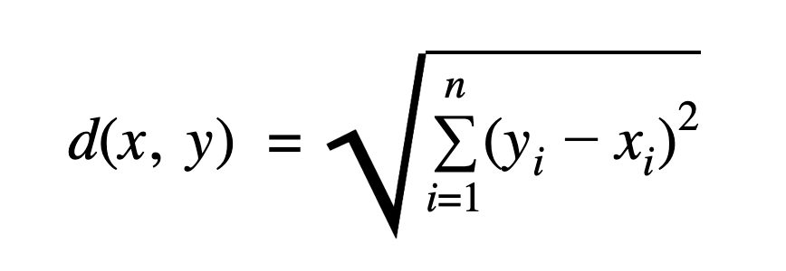
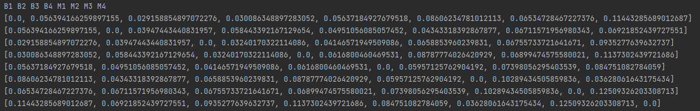
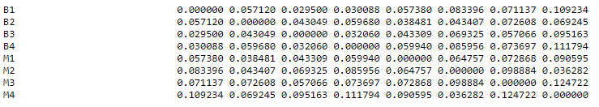
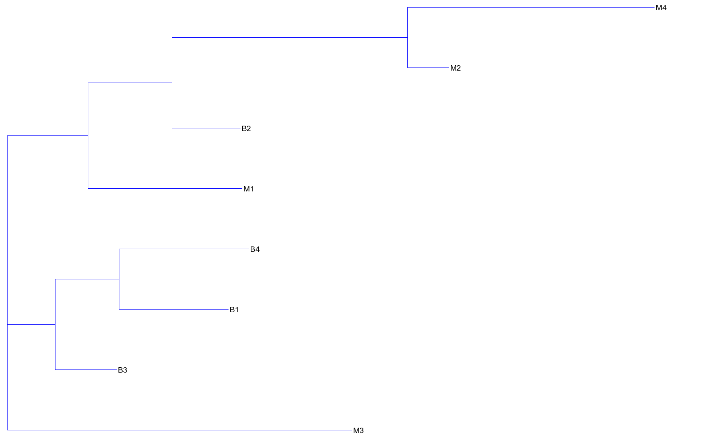
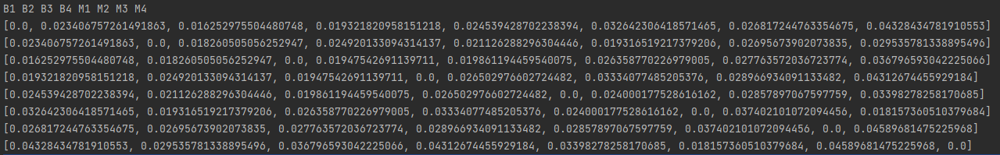
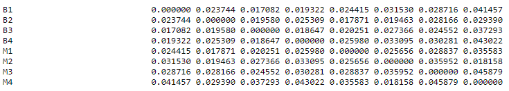
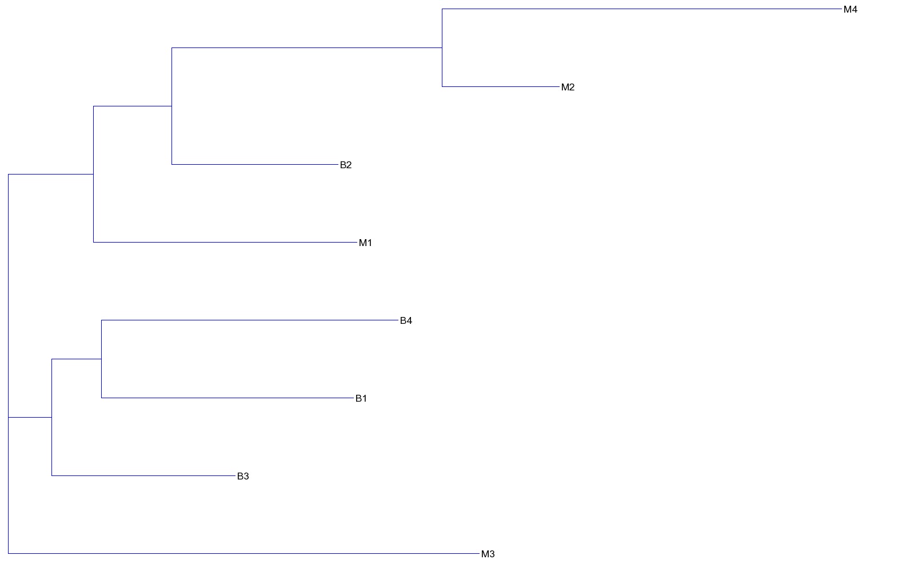

#Ingvaras Galinskas
##Bioinformatika
###Pirmojo laboratorinio darbo analizė

Darbo tikslas: įvertinti kodonų ir dikodonų dažnio skirtumus zinduolių ir bakterijų virusuose.

Šiame darbe atstumų matricai skaičiuoti buvo naudojama euklidinio atstumo formulė:

Buvo lyginami 4 bakteriniai virusiai(B1 - B4) ir 4 žinduoliams būdingi virusai (M1 - M4)

####Kodonų dažnių atstumo matrica

####Kodonų dažnių atstumo matrica (Phylip formatas)

####Kodonų dažnių klasterizavimas (Neighbour joining metodas)

####Dikodonų dažnių atstumo matrica

####Dikodonų dažnių atstumo matrica (Phylip formatas)

####Dikodonų dažnių klasterizavimas (Neighbour joining metodas)

Iš rezultatų matyti, jog kodonų, dikodonų dažnis tarp žinduolių ir bakterijų virusų skiriasi. Bakteriniai virusai B1, B3, B4 klasterizavosi į vieną grupę, tuo tarpu žinduolių virusai M1, M2, M4 bei bakterijų virusas B2 klasterizavosi į kitą grupę. Labiausiai nepanašus į kitus virusus buvo žinduolių virusas M3.
