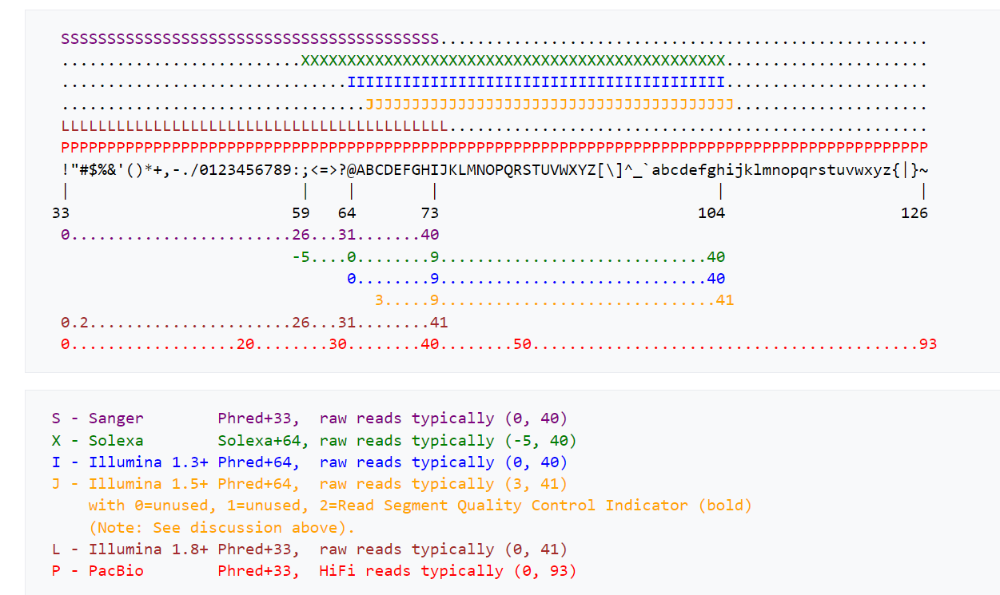

# Ingvaras Galinskas
## Bioinformatika
## 1 Laboratorinis Darbas

Darbo tikslas: įvertinti kodonų ir dikodonų dažnio skirtumus zinduolių ir bakterijų virusuose.

Šiame darbe atstumų matricai skaičiuoti buvo naudojama euklidinio atstumo formulė:

Buvo lyginami 4 bakteriniai virusiai(B1 - B4) ir 4 žinduoliams būdingi virusai (M1 - M4)

#### Kodonų dažnių atstumo matrica

#### Kodonų dažnių atstumo matrica (Phylip formatas)

#### Kodonų dažnių klasterizavimas (Neighbour joining metodas)

#### Dikodonų dažnių atstumo matrica

#### Dikodonų dažnių atstumo matrica (Phylip formatas)

#### Dikodonų dažnių klasterizavimas (Neighbour joining metodas)

Iš rezultatų matyti, jog kodonų, dikodonų dažnis tarp žinduolių ir bakterijų virusų skiriasi. Bakteriniai virusai B1, B3, B4 klasterizavosi į vieną grupę, tuo tarpu žinduolių virusai M1, M2, M4 bei bakterijų virusas B2 klasterizavosi į kitą grupę. Labiausiai nepanašus į kitus virusus buvo žinduolių virusas M3.

## 2 Laboratorinis Darbas
### 1. Interpretation.....how did the Covid-19 evolve, what path through hosts was taken? 
Iš gautojo medžio (After.txt) panašu, kad Covid-19 vystėsi iš kupranugariams būdingo viruso (medžio šaknis). Pats Covid-19 yra giminingas kitiems kvėpavimo apsunkinimus sukeliantiems koronavirusams, kurie pagal gautąjį medį, panašu, kad vystėsi iš šikšnosparniams būdingų virusų.
### 2. Would it be different interpretation if out-group is not used?
Kitu atveju (Before.txt) gaunasi, jog covid-19 šaknis buvo kiti SARS koronavirusai. Nesikeičia tik artimiausi giminaičiai ir tai, jog covid-19 išsivystė iš šikšnosparniams būdingų virusų.
### 3. What about Urbani SARS origin?
Iš gautojo medžio nėra aiški Urbani SARS kilmė
### 4. Is the Palm Civet origin evident?
Iš gautojo medžio nėra aiški Palm Civet kilmė
## 3 Laboratorinis Darbas
###1
FASTQ formatas yra tekstinio pagrindo (text-based) formatas skirtas saugoti nukleotidų sekai ir ją atitinkantiems kokybiniams įverčiams.
Lyginant su FASTA, FASTĄ papildomai turi sekos ID ir kokybės įverčius. Kokybės įverčiai parodo, kaip tiksliai buvo nuskenuota seka.
Įverčiai koduojami ASCII simboliai. Čia yra visi galimi kodavimo simboliai tinkantys apibūdinti sekos kokybę (nuo blogiausio iki geriausio):
!"#$%&'()*+,-./0123456789:;<=>?@ABCDEFGHIJKLMNOPQRSTUVWXYZ\]^_`abcdefghijklmnopqrstuvwxyz{|}~
###2
Gimiau 21 dieną. 21 + 33 = 54. Tai atitinka simbolį "6".
###3
Nes pirmi 32 ASCII simboliai yra naudojami (rezervuoti) kompiuterinių sistemų, nes turi svarbią kompiuterinę paskirtį.
###4
####a) 
Sanger Phred+33 arba Illumina 1.8+ Phred+33.
Nepavyko nustatyti tiksliai, nes šios dvi koduotės yra labai panašios ir skiriasi tik vienu simboliu.
Nustatinėjant koduotes rėmiausi šia lentele. Šaltinis: https://en.wikipedia.org/wiki/FASTQ_format

####b) 
Yra matomi 3 stambūs pikai C/G nukleotidų santykio pasiskirstymo read'uose grafike

####c) 

###5
Mėginyje buvo šių rūšių bakterijų: 
<li>Staphylococcus aureus - bakterija dažnai randama žmogaus organizme</li>
<li>Escherichia coli - bakterija gyvenanti šiltakraujuose organizmuose</li>
<li>Thermus thermophilus - šilumą (~65 °C) mėgstanti bakterija</li>
